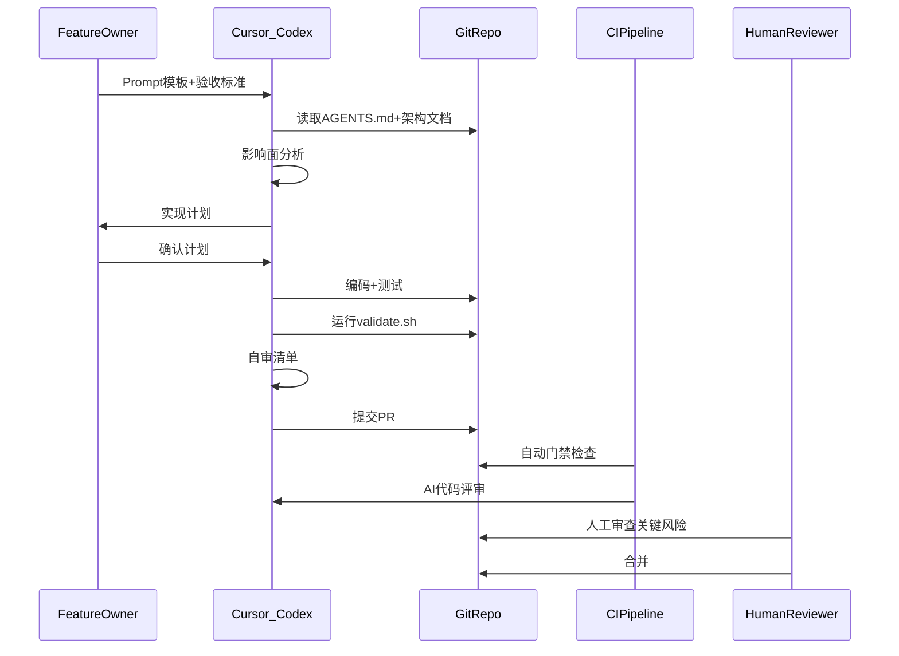

# 核心数据流

描述 Agent 执行任务时的信息与控制流。

## 任务执行数据流



## 规则传播流

```
playbook 仓库
  ├── .cursor/rules/  ──copy──▶  业务仓库 .cursor/rules/
  ├── AGENTS.md       ──adapt──▶  业务仓库 AGENTS.md
  ├── templates/      ──copy──▶  业务仓库 templates/
  └── scripts/        ──copy──▶  业务仓库 scripts/
```

规则变更流程：
1. AI Tech Lead 在 playbook 中更新
2. 各业务仓库 periodic sync（建议每周）
3. 业务仓库特有规则放在 `.cursor/rules/99-project-specific.mdc`

## CI 数据流

```
PR 创建/更新
  → structure-check (scripts/check-structure.sh)
  → doc-freshness (scripts/check-doc-freshness.sh)
  → ai-review (templates/prompts/self-review.md 引导)
  → 人工 review（关键目录）
  → merge
```

## 夜间巡检流

```
Cron 触发 (每日 02:00 UTC)
  → nightly-audit.sh
    → 文档过期检查
    → 结构约束检查
    → 约束偏离报告
  → 自动创建 issue（如有问题）
```

## 指标采集流

```
PR 事件 / CI 结果 / Review 评论
  → metrics-collect.sh
  → docs/metrics/dashboard-data.json
  → 每周复盘使用 dashboard-data.json
```
