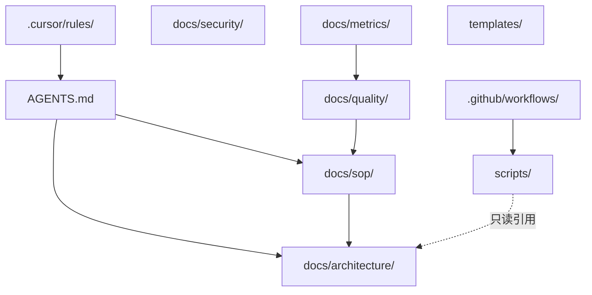

# 模块边界

每个模块的职责、依赖方向和 Agent 修改权限。

## 模块注册表

| 模块 | 路径 | 职责 | 可依赖 | 禁止依赖 |
|------|------|------|--------|----------|
| AgentRules | `.cursor/rules/` | Cursor Agent 行为约束 | AGENTS.md | scripts/, templates/ |
| AgentNav | `AGENTS.md` | Agent 入口导航 | docs/ | — |
| Architecture | `docs/architecture/` | 架构文档 | — | scripts/ |
| SOP | `docs/sop/` | 标准作业流 | docs/architecture/ | .cursor/rules/ |
| Quality | `docs/quality/` | 质量门禁文档 | docs/sop/ | — |
| Security | `docs/security/` | 安全策略 | — | — |
| Metrics | `docs/metrics/` | 指标与复盘 | docs/quality/ | — |
| Onboarding | `docs/onboarding/` | 新成员上手 | docs/sop/ | — |
| PromptTemplates | `templates/prompts/` | 标准 Prompt | — | — |
| PRTemplates | `templates/pr/` | PR/Issue 模板 | — | — |
| CodexConfig | `templates/codex/` | Codex 配置示例 | — | — |
| Scripts | `scripts/` | 可执行约束 | docs/ (只读) | templates/ (运行时) |
| CI | `.github/workflows/` | CI 门禁 | scripts/ | — |

## 依赖方向图

## 扩展新模块

添加新模块时必须：

1. 在本表注册一行
2. 更新依赖方向图
3. 在 `scripts/check-structure.sh` 添加约束
4. 在 `AGENTS.md` 目录表添加条目

## Agent 修改权限

| 权限级别 | 路径 | 说明 |
|----------|------|------|
| 只读 | `.cursor/rules/`, `docs/security/` | 除非任务明确要求 |
| 需审批 | `.github/workflows/`, `scripts/check-structure.sh` | Quality Owner review |
| 可修改 | `docs/`, `templates/`, 一般 `scripts/` | 正常 PR 流程 |
| 禁止 | `.env`, credentials | 任何情况 |
